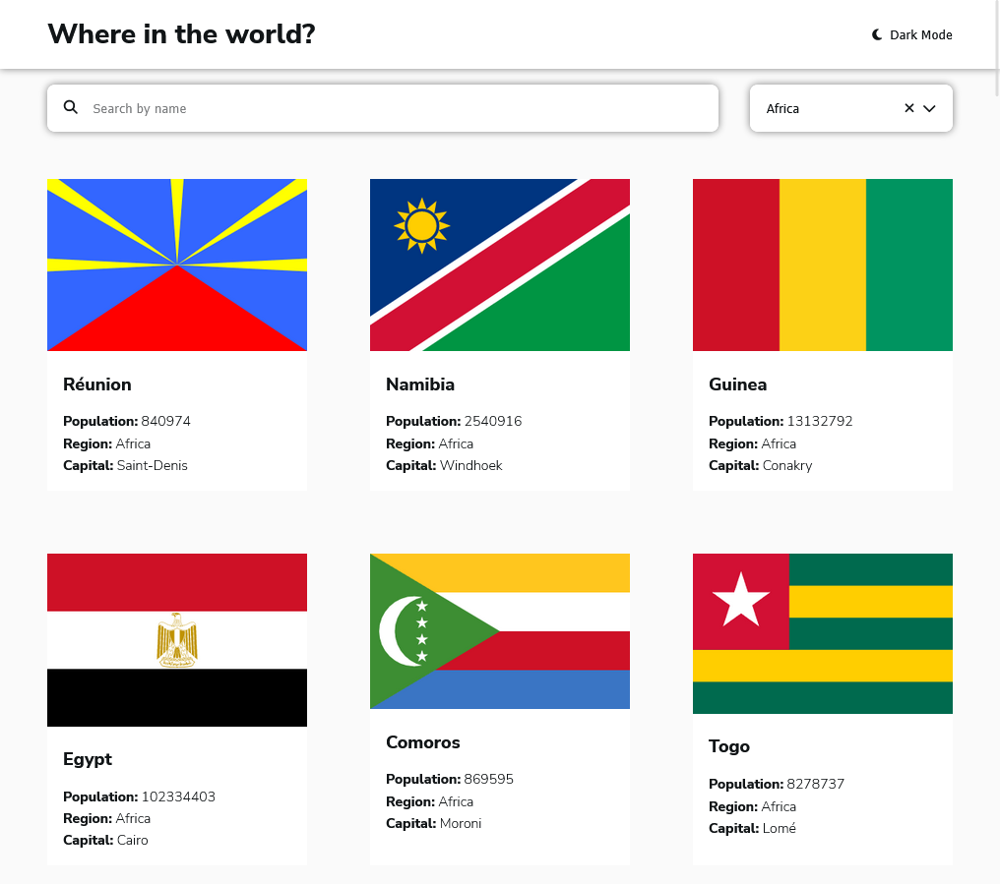
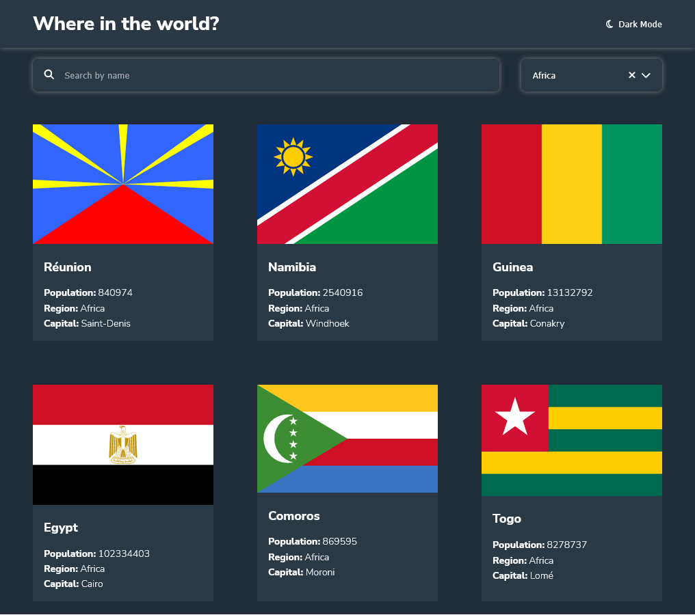
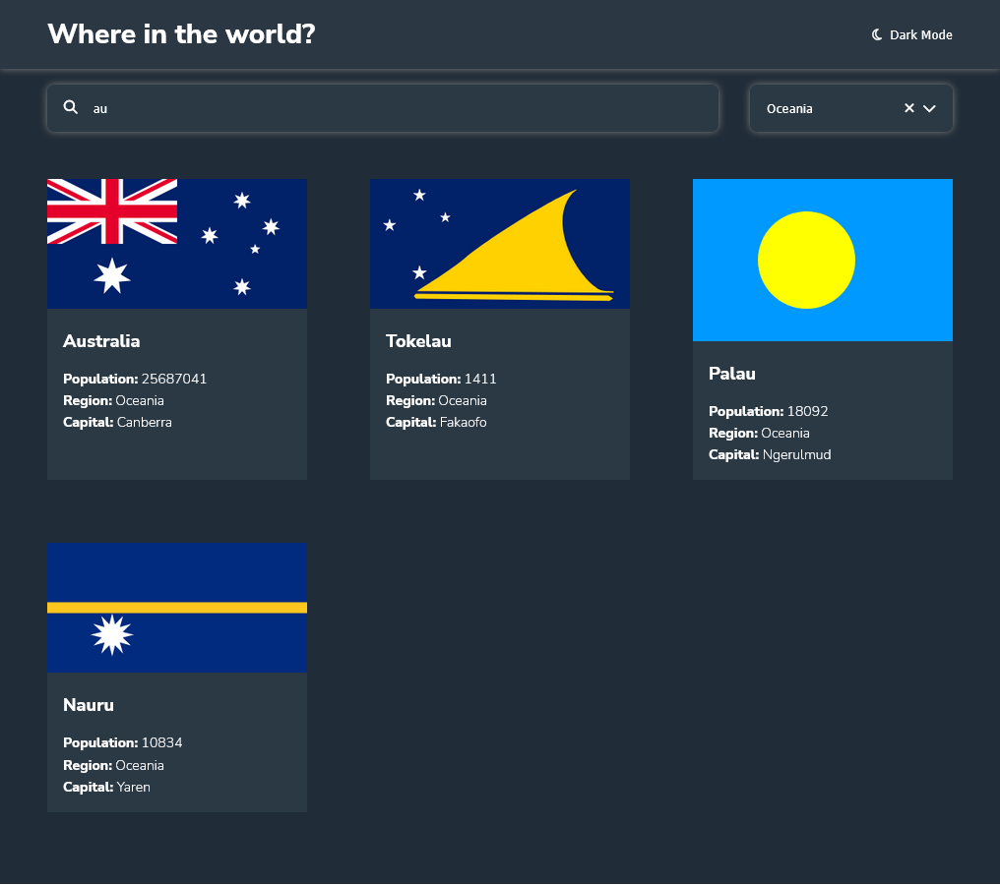
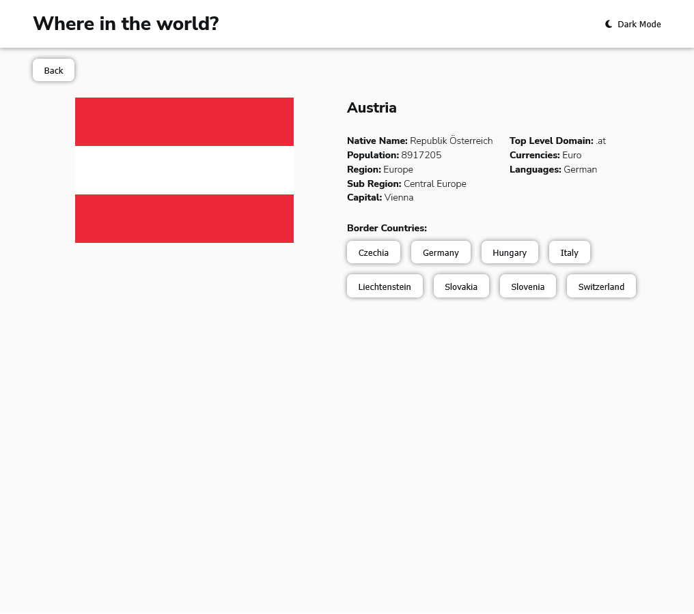

# Frontend Mentor - REST Countries API with color theme switcher solution

This is a solution to the [REST Countries API with color theme switcher challenge on Frontend Mentor](https://www.frontendmentor.io/challenges/rest-countries-api-with-color-theme-switcher-5cacc469fec04111f7b848ca). Frontend Mentor challenges help you improve your coding skills by building realistic projects. 

## Table of contents

- [Overview](#overview)
  - [The challenge](#the-challenge)
  - [Screenshot](#screenshot)
  - [Links](#links)
- [My process](#my-process)
  - [Built with](#built-with)
  - [What I learned](#what-i-learned)
  - [Continued development](#continued-development)
  - [Useful resources](#useful-resources)
- [Author](#author)

## Overview

### The challenge

Users should be able to:

- See all countries from the API on the homepage
- Search for a country using an `input` field
- Filter countries by region
- Click on a country to see more detailed information on a separate page
- Click through to the border countries on the detail page
- Toggle the color scheme between light and dark mode *(optional)*

### Screenshot

### Links

- Solution URL: [this github page](https://github.com/Jagholin/countries-rest)
- Live Site URL: [https://thunderous-dango-0227f1.netlify.app](https://thunderous-dango-0227f1.netlify.app)

## My process

### Built with

- [React](https://reactjs.org/) - JS library
- [Emotion](https://emotion.sh) - Alternative to styled-components
- [React Router](https://reactrouter.com/) - Routing
- [Redux](https://redux.js.org/) - State management
- [Axios](https://axios-http.com/) - HTTP client
- [Redux Toolkit](https://redux-toolkit.js.org/) - Redux toolset
- [Playwright](https://playwright.dev/) - E2E testing

### What I learned

This was my first time using Redux for state management(which was clearly an overkill for this small project) and I learned a lot about it. I also learned how to use Playwright for E2E testing. I was already familiar with emotion since I used it in other projects as part of Material UI.

In this project I also tried to implement a combobox control element from scratch following the WAI/ARIA guidelines. Not sure if I did it right, and I certainly will not try to reinvent the wheel next time, but it was a good learning experience.

Another thing I tried to do in this project is to follow Cube CSS methodology for styling. I had some problems figuring out how to do it with Emotion, and in the end I'm not sure if I did a good job with it, hence I'm not adding it to the list of technologies used for this project. I still tried to follow the general idea of Cube CSS to separate layout and styling.

### Continued development

As it is right now, the app is completely functional, but there are some things that can be improved in the future. I use Playwright for E2E testing, but I dont have many tests yet. I also use Redux store to save Promises for fetching data, which is not what you supposed to do (and yes I know that it complains about it in the console). But it works and for _this particular project_ it is not a big deal. I looked into using RTK Query for this, but it would be an even bigger overkill for this project and I decided to just leave it as is for now.

Also I think I will redo the styling for this project in the future, to have much more clear and consistent separation of concerns. I'm still trying to figure out how to best do it with tools like Emotion.

### Useful resources

 - [WAI/ARIA guidelines for combobox pattern](https://www.w3.org/WAI/ARIA/apg/patterns/combobox/)
 - [Cube CSS methodology](https://cube.fyi/)
## Author

- Website - [https://flyingsquirrels.de/](https://flyingsquirrels.de/)
- Frontend Mentor - [@Jagholin](https://www.frontendmentor.io/profile/Jagholin)

